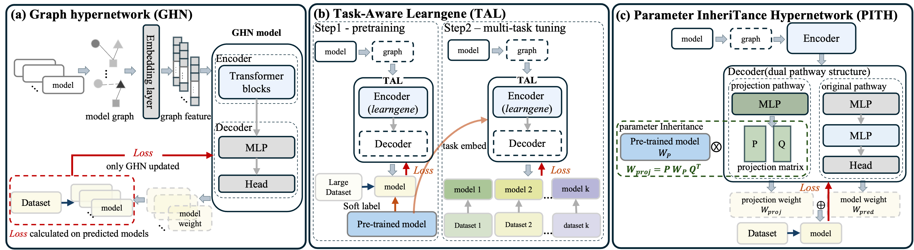
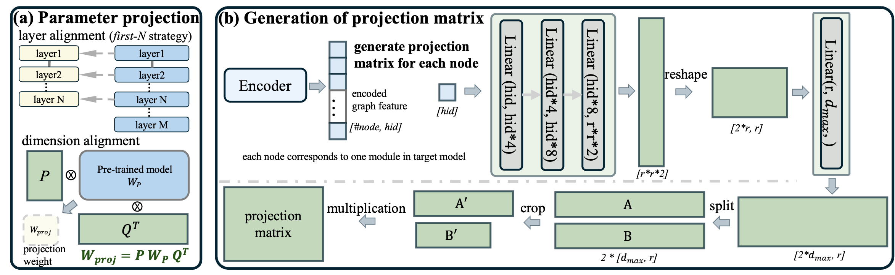

# PITH: Parameter InheriTance HyperNetwork

<p align="center">
  <strong>Unlocking Pre-trained Weights:<br>
  Parameter Inheritance for Zero-Shot Initialization</strong>
</p>

<p align="center">
  <a href="https://cvpr.thecvf.com/virtual/2026/poster/38910"></a>
  <a href="https://github.com/mathieuxu/PITH-Parameter-InheriTance-HyperNetwork"></a>
  
  
</p>

Official implementation of **Parameter InheriTance HyperNetwork (PITH)**, accepted to **CVPR 2026**. PITH is a graph-hypernetwork framework for **zero-shot parameter initialization**: it directly inherits knowledge from pre-trained weights and generates initialization parameters for target networks with different configurations.

<p align="center">
  
</p>

## Highlights

- **Direct parameter inheritance.** Instead of only using pre-trained models as soft-label teachers, PITH directly projects internal pre-trained weights into target model parameters.
- **Zero-shot initialization.** A PITH-initialized network can achieve competitive accuracy immediately after initialization, without downstream training or fine-tuning.
- **Flexible target architectures.** PITH predicts parameters for ViT-style models with different depths and hidden dimensions.
- **Dual-pathway decoder.** PITH combines a projection pathway that inherits pre-trained weights with an original pathway that predicts residual parameters.
- **Strong empirical performance.** ViT-Base initialized by PITH reaches **53.35% zero-shot accuracy on ImageNet-1K**, surpassing TAL by **6.54%**.

## Method Overview

Graph HyperNetworks (GHNs) predict parameters from a target architecture graph. Recent methods such as TAL use pre-trained models through indirect functional supervision, for example soft labels. PITH asks a more direct question: can we inherit the actual pre-trained weights?

PITH introduces a **parameter projection mechanism**. Given a pre-trained model with parameters \(W_p\), the hypernetwork dynamically generates projection matrices \(P\) and \(Q\), and maps the pre-trained weights into the target model space:

```text
W_proj = P W_p Q^T
```

The final target parameters are produced by combining two sources:

```text
W_target = alpha * W_proj + (1 - alpha) * W_pred
```

where `W_proj` comes from projected pre-trained parameters and `W_pred` comes from the original hypernetwork decoder.

<p align="center">
  
</p>

PITH further uses **progressive dimension expansion**, replacing large-stride dimensional jumps with gradual MLP-based expansion. This stabilizes parameter generation and reduces information loss when producing weights for target networks of different sizes.

## Main Results

### ImageNet-1K Zero-shot Initialization

PITH improves zero-shot initialization quality across ViT scales. For 12-layer ViT-Base, PITH reaches **53.35%** top-1 accuracy without further training.

| Method | Tiny | Small | Base |
| --- | ---: | ---: | ---: |
| GHN-3 | 34.95 | 35.33 | 33.74 |
| LoGAH | 26.31 | 44.82 | 44.85 |
| TAL | 37.63 | 46.74 | 46.81 |
| **PITH** | **46.35** | **53.27** | **53.35** |

### ImageNet-1K After Further Training

After 75 epochs of training, PITH-initialized models maintain a clear advantage.

| Model | RandInit | GHN-3 | LoGAH | TAL | PITH |
| --- | ---: | ---: | ---: | ---: | ---: |
| Small | 64.38 | 49.73 | 64.53 | 65.48 | **67.19** |
| Base | 61.31 | 45.08 | 62.45 | 64.28 | **67.29** |

### Decathlon and Unseen Tasks

On Visual Domain Decathlon tasks, PITH consistently outperforms prior hypernetwork initializers in both untrained and trained settings. It also shows strong transfer to unseen downstream tasks such as Fashion-MNIST, FER2013, and HAM10000.

Please refer to the paper for full tables, ablations, and analysis.

## Repository Structure

```text
PITH-Parameter-InheriTance-HyperNetwork/
├── README.md
├── assets/
│   ├── pith_overview.png
│   └── pith_method.png
└── pith/
    ├── train_pith.py
    ├── train_pith_decathlon.py
    ├── vit_generator.py
    ├── task_embeddings.pt
    ├── ghn3/
    │   ├── nn_pith.py
    │   └── trainer_pith.py
    └── ghn3_mtl/
        ├── nn_pith.py
        └── trainer_pith.py
```

Key files:

- `pith/train_pith.py`: trains PITH on ImageNet with ViT-L/16 teacher support.
- `pith/train_pith_decathlon.py`: multi-task PITH training on Decathlon datasets.
- `pith/ghn3/nn_pith.py`: PITH hypernetwork and parameter inheritance modules.
- `pith/ghn3_mtl/nn_pith.py`: multi-task PITH hypernetwork implementation.
- `pith/vit_generator.py`: generates the ViTs+-1K architecture dataset.
- `pith/sample.py`: temperature-based sampler for multi-task training.

## Installation

Clone the repository:

```bash
git clone https://github.com/mathieuxu/PITH-Parameter-InheriTance-HyperNetwork.git
cd PITH-Parameter-InheriTance-HyperNetwork/pith
```

Create the conda environment:

```bash
conda env create -f env.yml
conda activate ghn
```

Install PPUDA:

```bash
pip install git+https://github.com/facebookresearch/ppuda.git
```

The provided environment is based on PyTorch 2.2. If your CUDA version differs, install the matching PyTorch build from the official PyTorch installation guide.

## Data Preparation

### ImageNet

Prepare ImageNet-1K in the standard torchvision folder format:

```text
/path/to/imagenet/
├── train/
│   ├── n01440764/
│   └── ...
└── val/
    ├── n01440764/
    └── ...
```

### Visual Domain Decathlon

The Decathlon training script expects COCO-style annotation files and image folders:

```text
./data/decathlon/
├── annotations/
│   ├── aircraft_train.json
│   ├── aircraft_val.json
│   └── ...
├── decathlon_mean_std.pickle
└── ...
```

The default tasks are:

```text
aircraft, cifar100, daimlerpedcls, dtd, gtsrb, omniglot, svhn, ucf101, vgg-flowers
```

## Architecture Dataset

Generate the ViTs+-1K architecture dataset with:

```bash
python vit_generator.py
```

## Training

### Train PITH on ImageNet

```bash
python train_pith.py \
    -n -v 50 --ln --amp -m 1 \
    --name pith-imagenet \
    -d imagenet --data_dir /path/to/imagenet \
    --batch_size 512 --hid 128 --lora_r 90 --layers 5 --heads 16 \
    --opt adamw --lr 0.3e-3 --wd 1e-2 --scheduler cosine-warmup \
    --debug 0 --max_shape 4096 --lora --use_teacher
```

### Multi-task Training on Decathlon

Before running Decathlon training, place the ImageNet-trained checkpoint at:

```text
pith/checkpoints/pith/checkpoint.pt
```

Then run:

```bash
python train_pith_decathlon.py \
    -n -v 50 --ln -e 100 --amp -m 1 \
    --name pith-decathlon \
    -d imagenet --data_dir /path/to/imagenet \
    --batch_size 256 --hid 128 \
    --lora_r 90 --layers 5 --heads 16 \
    --opt adamw --lr 0.3e-3 --wd 1e-2 --scheduler cosine-warmup \
    --debug 0 --max_shape 4096 --lora --use_teacher
```

### Distributed Training

Both training scripts use PyTorch DistributedDataParallel when launched with `torchrun`:

```bash
torchrun --nproc_per_node 8 train_pith.py \
    -n -v 50 --ln --amp -m 1 \
    --name pith-imagenet \
    -d imagenet --data_dir /path/to/imagenet \
    --batch_size 512 --hid 128 --lora_r 90 --layers 5 --heads 16 \
    --opt adamw --lr 0.3e-3 --wd 1e-2 --scheduler cosine-warmup \
    --debug 0 --max_shape 4096 --lora --use_teacher
```

## Citation

If this repository is useful for your research, please cite:

```bibtex
@inproceedings{xu2026pith,
  title     = {Unlocking Pre-trained Weights: Parameter Inheritance for Zero-Shot Initialization},
  author    = {Xu, Jiaze and Xia, Shiyu and Lv, Jiaqi and Geng, Xin},
  booktitle = {Proceedings of the IEEE/CVF Conference on Computer Vision and Pattern Recognition},
  year      = {2026}
}
```

## Acknowledgements

This codebase builds on Graph HyperNetworks, LoGAH, TAL, and [PPUDA](https://github.com/facebookresearch/ppuda). We thank the authors for releasing their code and models.

## Contact

For questions, please open an issue in this repository.
